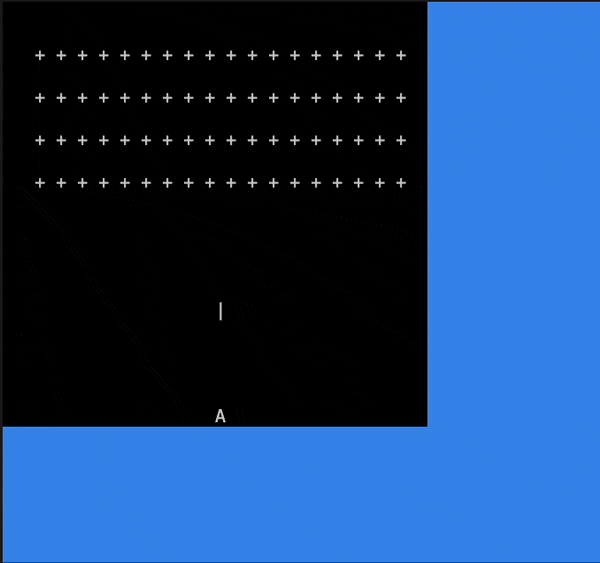
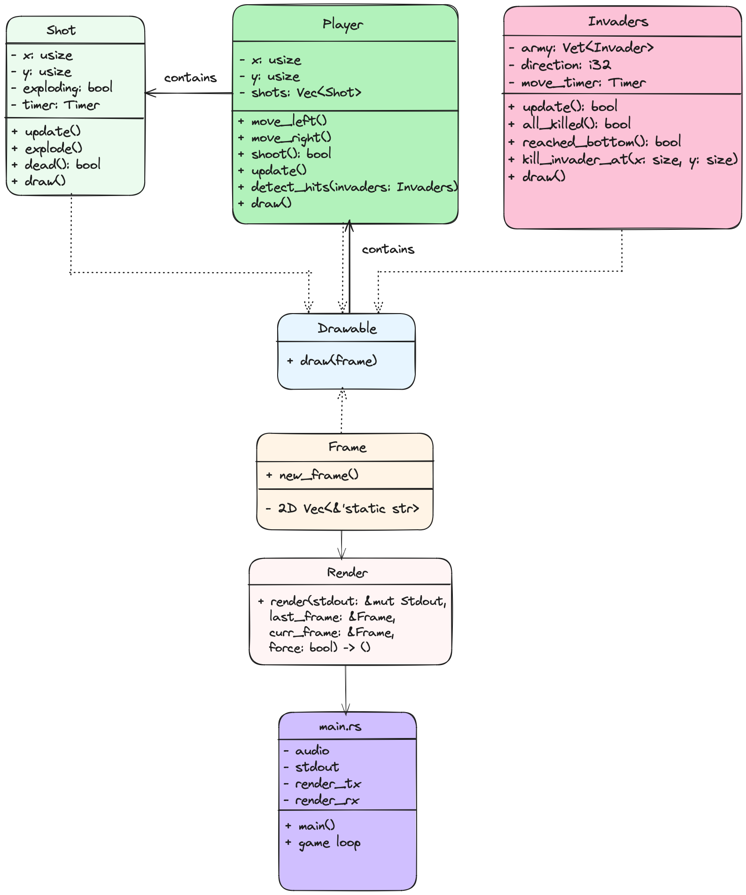

# 🚀 Invaders

## Description
👾 Invaders is a terminal-based space invaders game developed in Rust. The game features a player-controlled spaceship that can move left or right and shoot at incoming invaders. The objective is to destroy all invaders before they reach the bottom of the screen.

## Features
- 🚀 Player movement and shooting mechanics.
- 🎮 Progressive difficulty with increasing speed of invaders.
- 🔊 Sound effects for shooting, explosions, and game events.

## Installation
To run 🚀 Invaders, you need to have Rust and Cargo installed on your machine.

1. Clone the repository:
   ```bash
   git clone https://github.com/yourusername/gametitle.git
   cd invaders
2. Build and run the game:
    ```bash
    cargo run

## Game Rules
- 👾 Use the left and right arrow keys to move your spaceship.
- 💥 Press space to shoot at the invaders.
- 🚫 Avoid letting invaders reach the bottom of the screen or it’s game over.
- ⭐ The game increases in difficulty as more waves of invaders are defeated.

## How to Play
- 🎮 Launch the game from a terminal: `cargo run`
- 🕹️ Control the spaceship using the keyboard:
- ⬅️ `Left Arrow`: Move left
- ➡️ `Right Arrow`: Move right
- 🔫 `Spacebar`: Shoot

## Game Demo


## Class Diagram
